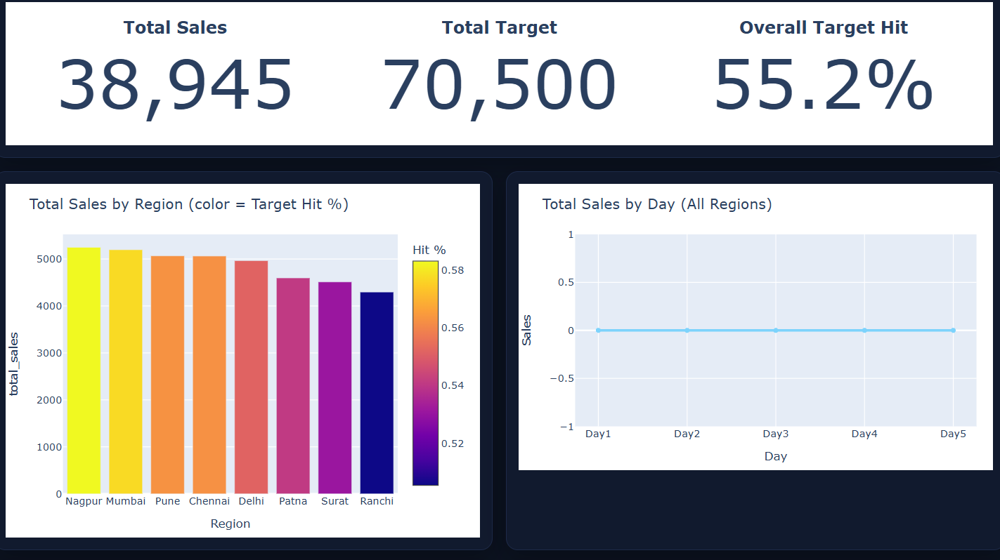

# sales-data
This dataset contains transactional sales data used to analyze business performance across different regions, products, and customer segments. It enables the creation of interactive dashboards to track revenue trends, profitability, and key performance indicators (KPIs).

# 📊 Interactive Sales Analytics Dashboard

🚀 **Explore the Live Dashboard:**  
👉 https://sales-data-rho.vercel.app/

## 🚀 Project Overview
The **Interactive Sales Analytics Dashboard** is a business intelligence project developed to analyze sales data and generate actionable insights through dynamic visualizations.

This project showcases an end-to-end workflow including data cleaning, analysis, dashboard creation, and cloud deployment — reflecting real-world data analyst responsibilities.

## 🎯 Business Objectives
- Identify top-performing regions and product categories  
- Monitor revenue and profit trends  
- Enable faster, data-driven decision-making  
- Present complex datasets in a clear visual format  

## 🧾 Dataset Description
The dataset contains transactional sales records used to evaluate overall business performance.

### **Key Attributes**
- **Sales Amount** – Total revenue generated  
- **Profit** – Profitability metrics  
- **Customer Segments** – Consumer classification  
- **Product Categories & Sub-Categories** – Product-level insights  
- **Geographic Regions** – Regional performance comparison  
- **Order Dates** – Time-based trend analysis  

The data was cleaned and structured to ensure accurate and meaningful visualizations.

## 🛠️ Tech Stack
- **Excel** → Data cleaning & preparation  
- **HTML** → Dashboard structure  
- **JavaScript** → Interactivity  
- **Plotly.js** → Interactive charts  
- **Vercel** → Deployment & hosting  

---

## ✨ Key Features
✅ Interactive charts for deeper analysis  
✅ Region-wise sales comparison  
✅ Profitability tracking  
✅ Category performance insights  
✅ Time-based sales trends  
✅ Fully deployed live dashboard  
✅ Clean and intuitive UI  

## 📈 Skills Demonstrated
- Data Analysis  
- Data Visualization  
- Dashboard Development  
- Business Insight Generation  
- Problem Solving  
- Cloud Deployment  

## 💡 How to Use
1. Click the **Live Dashboard** link above.  
2. Explore the interactive visualizations.  
3. Analyze trends across regions, categories, and profit metrics.

---

## 🔮 Future Enhancements
- Add advanced filtering options  
- Improve UI for enhanced user experience  
- Integrate real-time data sources  
- Implement predictive sales analytics  

## 👩‍💻 Author
**Vaishnavi Gowda**

If you found this project useful or interesting, consider giving it a ⭐ on GitHub!

## 📷 Dashboard Preview

  

